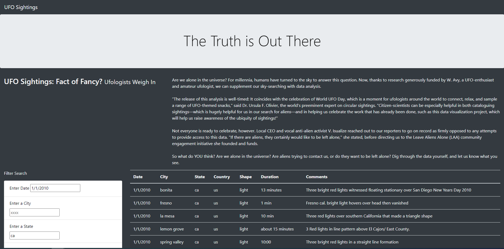

# ufo_challenge

## Purpose
The purpose of this exercise was to create a dynamic webpage including a filter with multiple criteria that narrows down UFO sightings byt city, state, date, country and shape at the same time.

## Execution
The project was executed using javascript to enter the base data for the website as well as developing the filters for the dynamic interface.  The website was created using HTML.

## Result
The webpage was successfully created with all filters working.  A sample of the working code is shown here:

